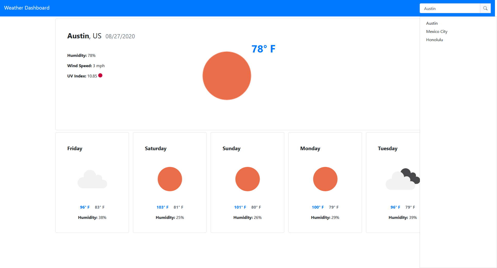

# Weather Dashboard

[View Weather Dashboard](https://nbur4556.github.io/weather-dashboard/)

## Description

Weather Dashboard shows weather information for a given city. Information includes current temperature, humidity, wind speed, and uv index. Also displays a five-day forecast for the given city. Features a robust city search system, that saves your search history for ease of access. Previous searched cities are available in the sidebar when the search input is clicked.

## Table of Contents

* [Installation](#Installation)
* [Usage](#Usage)
* [Technologies](#Technologies)
* [API](#API)
* [License](#License)
* [Contribution](#Contribution)
* [Tests](#Tests)
* [Contact](#Contact)

## Installation

Clone from github repo. Launch from the index.html file.

## Usage

Click on the search bar in the top right to search for a city. When a city is found weather information and a five day forecast will be presented. Your search history will be saved, and a history sidebar will be shown when you click on the search bar. Click on a city name in the sidebar to reload that weather data.

## Technologies

* HTML
* CSS
* JavaScript
* Bootstrap
* jQuery
* MomentJS

## API
[Open Weather Map](https://openweathermap.org/api) used to obtain weather information for specific cities.

## License

Weather Dashboard is licensed under the [MIT](https://opensource.org/licenses/MIT) license.

## Contribution

N/A

## Tests

N/A

## Contact

Reach out to me at the following

* Github: [https://github.com/nbur4556](https://github.com/nbur4556)
* Email: nbur4556@gmail.com